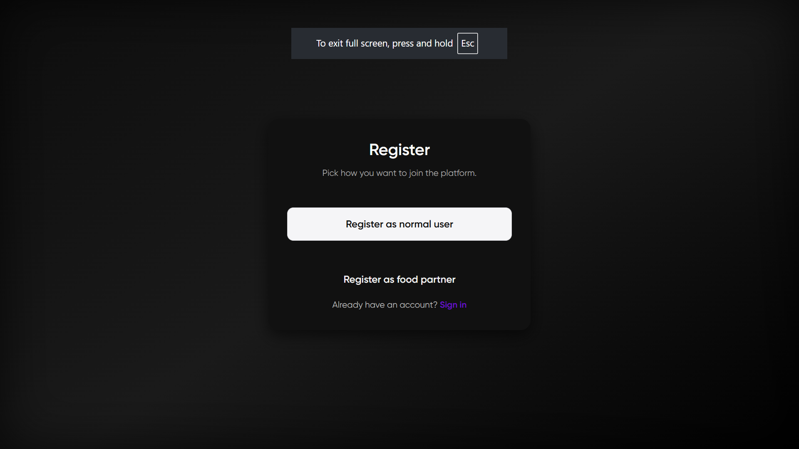
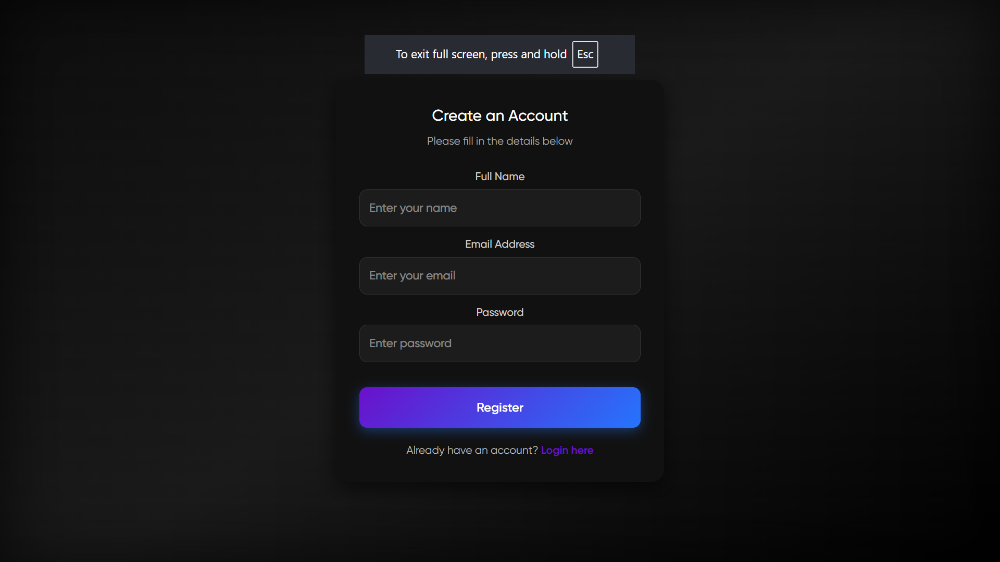
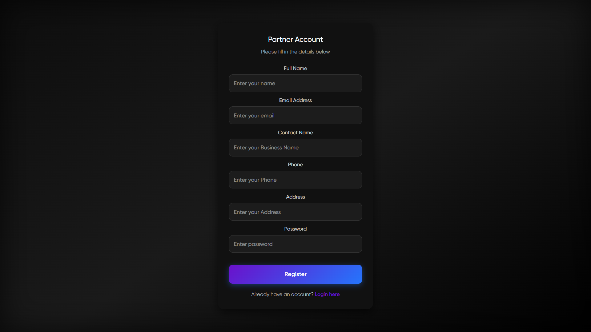
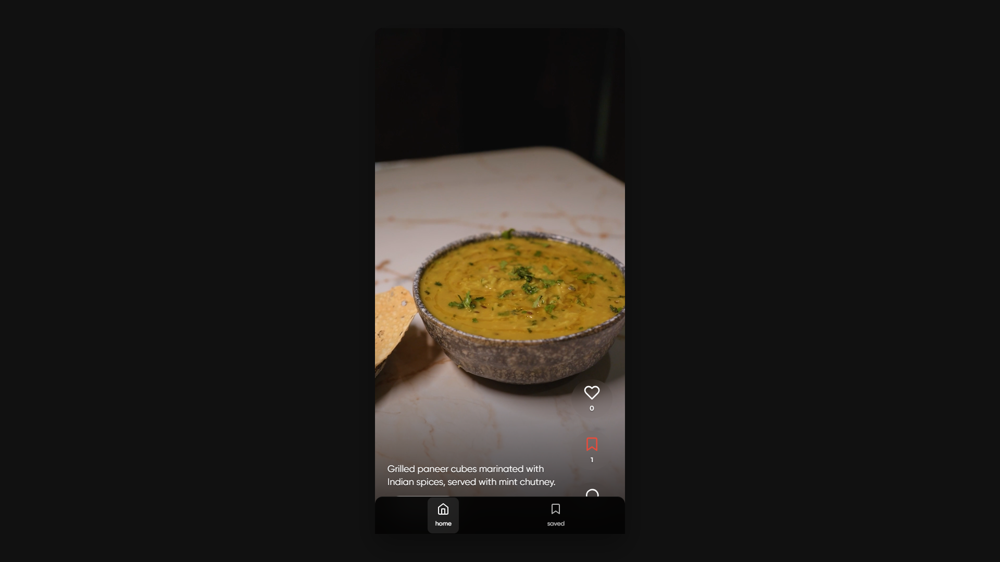
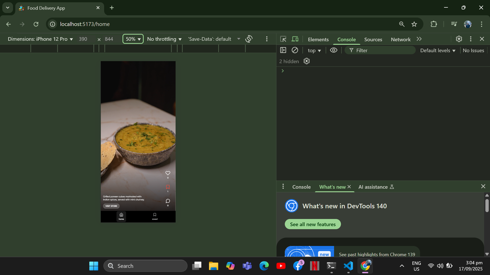
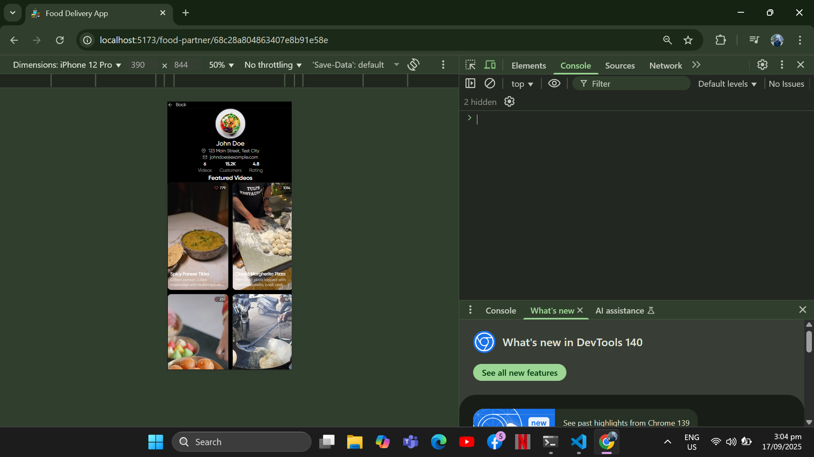
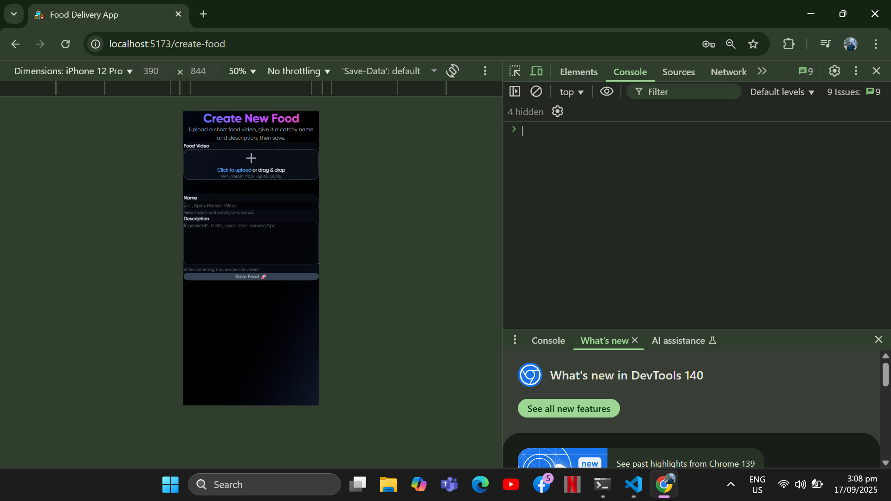

<h1 align="center" id="title">Food Reels Website</h1>

<p id="description">A full-stack app built with MongoDB Express React and Node.js where users can Sign up / log in with JWT auth Upload watch like and comment on short food reels Search reels by category or keywords Use on any device with a responsive UI</p>

<div align = "center">


</div>


<h2>Project Screenshots:</h2>














  
<h2>🧐 Features</h2>

Here're some of the project's best features:

*   User authentication with JWT (signup/login).
*   Upload and manage short food reels (videos).
*   Like comment and interact with other users’ reels.
*   Responsive design for mobile and desktop.

<h2>🛠️ Installation Steps:</h2>

<p>1. Clone the Repository</p>

```
https://github.com/piyush-777-debug/food-reels-app.git 
```

<p>2. Install dependencies (For Backend)</p>

```
cd backend npm install
```

<p>3. For Frontend</p>

```
cd frontend npm install
```

<p>4. Set up environment variables</p>

```
PORT=5000 MONGO_URI=your_mongodb_connection_string JWT_SECRET=your_jwt_secret
```

<p>5. Run the app</p>

```
npm run dev
```

<p>6. Open in browser</p>

```
Visit: http://localhost:3000
```

  
  
<h2>💻 Built with</h2>

Technologies used in the project:

*   React.js
*   MongoDB
*   Node.js
*   ExpressJS